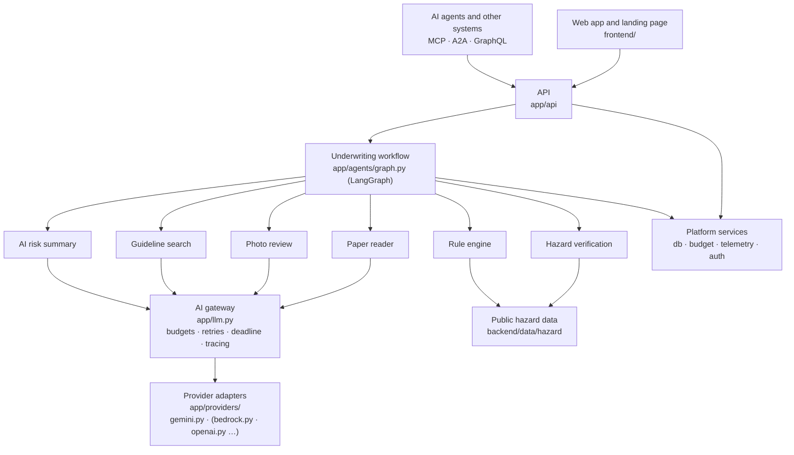

# Architecture

imaarat.ai is built in layers. Each layer talks only to the one below it, so any part can be replaced without touching the rest. The rules on this page are enforced by tests, not just described.



## The layers

| Layer | Where | What it owns | What it must not do |
|---|---|---|---|
| Interfaces | `app/api`, `app/graphql_api.py`, `app/interop.py` | HTTP, GraphQL, MCP and A2A; sign-in; input validation | contain underwriting logic |
| Workflow | `app/agents/graph.py` | the order of steps, the review pause, checkpoints | call a model directly |
| Components | `app/tools/`, `app/agents/report_agent.py`, `app/reports.py` | one underwriting job each: read a form, check hazards, score, review a photo, search guidelines, write the summary, build the PDF | import a vendor SDK |
| AI gateway | `app/llm.py` | every model call: daily and per-minute budgets, retries for busy errors only, the per-request deadline, tracing and token accounting | know which vendor it is talking to |
| Providers | `app/providers/` | translating one vendor's SDK into the shared contract, and its errors into `ProviderError` | apply budgets, retries or business rules |
| Platform | `app/db.py`, `app/budget.py`, `app/telemetry.py`, `app/auth.py` | storage, spending limits, request and trace records, sessions | depend on the layers above |

## Rules that CI enforces

`backend/tests/test_architecture.py` fails the build if:

1. any file outside `app/providers/` imports a vendor SDK (Google GenAI, OpenAI, Anthropic, boto3 for Bedrock, Sarvam, Mistral, Cohere);
2. any file outside `app/providers/` imports a specific adapter instead of `app.providers`;
3. a registered adapter's `generate`, `count_tokens` or `embed` signature differs from the contract in `app/providers/base.py`;
4. an unknown `AI_PROVIDER` does anything other than fail with the list of known providers.

## The provider contract

```python
class Provider(Protocol):
    name: str
    def generate(self, model, contents, *, system, schema, thinking, temperature, max_output_tokens) -> Reply: ...
    def count_tokens(self, model, text) -> int: ...
    def embed(self, model, texts, task) -> list[list[float]]: ...
```

- `contents` is a list of text and `ImageInput(data, mime_type)`; adapters convert images to their vendor's format.
- `Reply` carries the text and the input, output and thinking token counts. Output tokens include thinking, because that is what vendors bill.
- Every vendor error becomes `ProviderError(message, code, daily_quota)`. The gateway retries only codes 429, 500 and 503, never a spent daily quota, and only while the request's deadline allows.

## Swapping or adding a provider

Switching models within a provider is configuration only: set `AI_MODEL` and `AI_EMBEDDING_MODEL`.

Adding a provider, for example Amazon Bedrock:

1. Create `backend/app/providers/bedrock.py` with a `BedrockProvider` class whose `name` is `"bedrock"` and whose three methods follow the contract. Convert `ImageInput` to Bedrock's image block, and raise `ProviderError` with the HTTP status for throttling and server errors.
2. Add `"bedrock": "app.providers.bedrock:BedrockProvider"` to `ADAPTERS` in `backend/app/providers/__init__.py`, and its SDK to `requirements.txt`.
3. Deploy with `AI_PROVIDER=bedrock`, `AI_MODEL=<model id>`, `AI_EMBEDDING_MODEL=<embedding model id>` and the provider's credentials.
4. Run the evaluation and the form benchmark against it before switching production. A new provider changes accuracy, latency, cost and data terms, so it is measured, not assumed.

Nothing else changes: the components, workflow, budgets, retries, tracing and status page work the same.

## Configuration

| Variable | Default | Meaning |
|---|---|---|
| `AI_PROVIDER` | `gemini` | which adapter in `app/providers/` to use |
| `AI_API_KEY` | falls back to `GEMINI_API_KEY` | the selected provider's key |
| `AI_MODEL` | falls back to `GEMINI_MODEL`, then `gemini-3.8-flash` | the generation and vision model |
| `AI_EMBEDDING_MODEL` | `models/gemini-embedding-001` | the guideline-search embedding model |
| `AI_JUDGE_MODEL` | falls back to `GEMINI_FALLBACK_MODEL` | the evaluation judge |
| `AI_DAILY_GENERATIONS`, `AI_MINUTE_GENERATIONS` | 20, 5 | spending limits, matched to the provider's quota |

## Deployment

The same code runs on Vercel (one Python function behind `/api`, static pages for the rest) and in Docker (`compose.yaml`: Postgres, the API, and nginx serving the website). CI builds and smoke-tests both; see the README.
