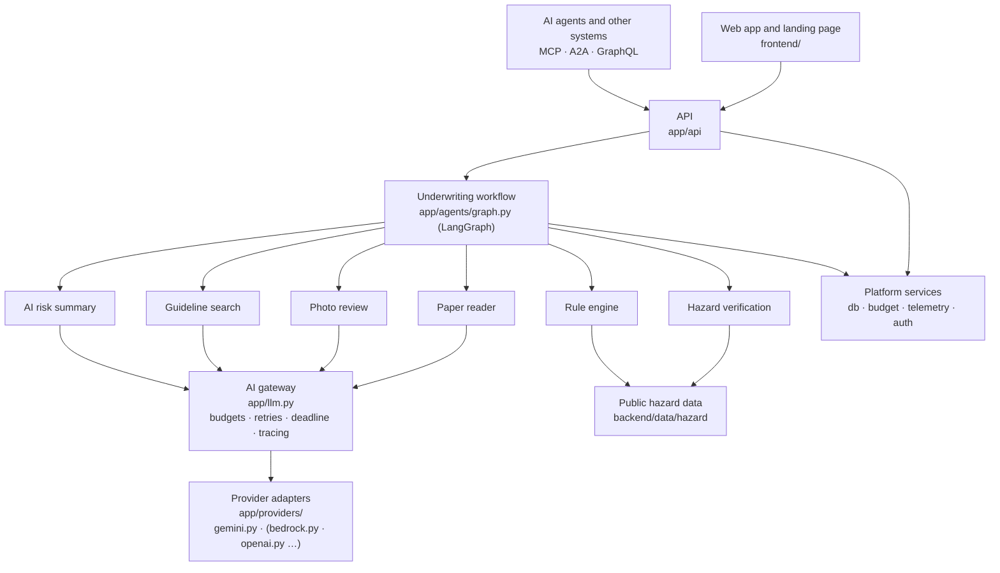
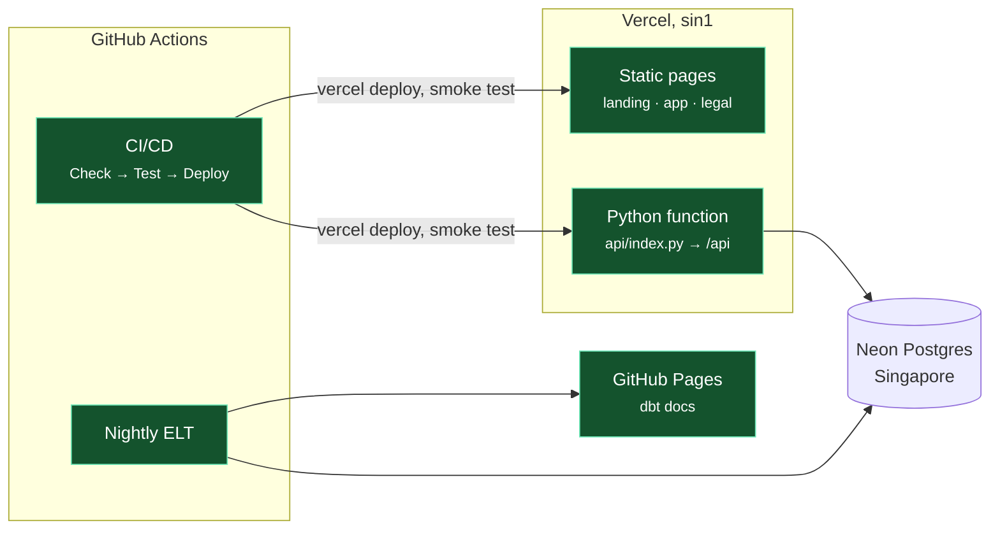

# Architecture

imaarat.ai is built in layers. Each layer talks only to the one below it, so any part can be replaced without touching the rest. The rules on this page are enforced by tests, not just described.



## The layers

| Layer | Where | What it owns | What it must not do |
|---|---|---|---|
| Interfaces | `app/api`, `app/graphql_api.py`, `app/interop.py` | HTTP, GraphQL, MCP and A2A; sign-in; input validation | contain underwriting logic |
| Workflow | `app/agents/graph.py` | the order of steps, the review pause, checkpoints | call a model directly |
| Components | `app/tools/`, `app/agents/report_agent.py`, `app/reports.py` | one underwriting job each: read a form, check hazards, score, review a photo, search guidelines, write the summary, build the PDF | import a vendor SDK |
| AI gateway | `app/llm.py` | every model call: daily and per-minute budgets, retries for busy errors only, the per-request deadline, tracing and token accounting | know which vendor it is talking to |
| Providers | `app/providers/` | translating one vendor's SDK into the shared contract, and its errors into `ProviderError` | apply budgets, retries or business rules |
| Platform | `app/db.py`, `app/budget.py`, `app/telemetry.py`, `app/auth.py` | storage, spending limits, request and trace records, sessions | depend on the layers above |

## Rules that CI enforces

`backend/tests/test_architecture.py` fails the build if:

1. any file outside `app/providers/` imports a vendor SDK (Google GenAI, OpenAI, Anthropic, boto3 for Bedrock, Sarvam, Mistral, Cohere);
2. any file outside `app/providers/` imports a specific adapter instead of `app.providers`;
3. a registered adapter's `generate`, `count_tokens` or `embed` signature differs from the contract in `app/providers/base.py`;
4. an unknown `AI_PROVIDER` does anything other than fail with the list of known providers.

## The provider contract

```python
class Provider(Protocol):
    name: str
    def generate(self, model, contents, *, system, schema, thinking, temperature, max_output_tokens) -> Reply: ...
    def count_tokens(self, model, text) -> int: ...
    def embed(self, model, texts, task) -> list[list[float]]: ...
```

- `contents` is a list of text and `ImageInput(data, mime_type)`; adapters convert images to their vendor's format.
- `Reply` carries the text and the input, output and thinking token counts. Output tokens include thinking, because that is what vendors bill.
- Every vendor error becomes `ProviderError(message, code, daily_quota)`. The gateway retries only codes 429, 500 and 503, never a spent daily quota, and only while the request's deadline allows.

## Swapping or adding a provider

Switching models within a provider is configuration only: set `AI_MODEL` and `AI_EMBEDDING_MODEL`.

Adding a provider, for example Amazon Bedrock:

1. Create `backend/app/providers/bedrock.py` with a `BedrockProvider` class whose `name` is `"bedrock"` and whose three methods follow the contract. Convert `ImageInput` to Bedrock's image block, and raise `ProviderError` with the HTTP status for throttling and server errors.
2. Add `"bedrock": "app.providers.bedrock:BedrockProvider"` to `ADAPTERS` in `backend/app/providers/__init__.py`, and its SDK to `requirements.txt`.
3. Deploy with `AI_PROVIDER=bedrock`, `AI_MODEL=<model id>`, `AI_EMBEDDING_MODEL=<embedding model id>` and the provider's credentials.
4. Run the evaluation and the form benchmark against it before switching production. A new provider changes accuracy, latency, cost and data terms, so it is measured, not assumed.

Nothing else changes: the components, workflow, budgets, retries, tracing and status page work the same.

## Configuration

| Variable | Default | Meaning |
|---|---|---|
| `AI_PROVIDER` | `gemini` | which adapter in `app/providers/` to use |
| `AI_API_KEY` | falls back to `GEMINI_API_KEY` | the selected provider's key |
| `AI_MODEL` | falls back to `GEMINI_MODEL`, then `gemini-3.8-flash` | the generation and vision model |
| `AI_EMBEDDING_MODEL` | `models/gemini-embedding-001` | the guideline-search embedding model |
| `AI_JUDGE_MODEL` | falls back to `GEMINI_FALLBACK_MODEL` | the evaluation judge |
| `AI_DAILY_GENERATIONS`, `AI_MINUTE_GENERATIONS` | 20, 5 | spending limits, matched to the provider's quota |

## Keeping the AI honest

| Concern | How it is handled |
|---|---|
| Structured output | JSON-schema mode with Pydantic models for the summary and photo review, then a mechanical check: the decision must match the rule engine, risk factors must be real flags, citations must be sections that were retrieved, and no invented amounts, rates or regulations. |
| One model, honest failure | Each call uses only the configured model. Busy errors (429, 500, 503) are retried at most once; a spent daily quota is never retried. There is no fallback model. When AI is unavailable the rules still decide, and the page says why in plain words. |
| Guideline search | Guidelines G1–G12 are embedded with `gemini-embedding-001` and stored in Postgres (or Qdrant when configured), re-indexed when the text changes. |
| Evals | A 24-property golden set measures decision accuracy, retrieval hit rate and recall, the summary contract, citation precision, and faithfulness through a DeepEval judge. TOON and JSON prompts are compared on the same cases. |
| Tracing | Langfuse records every workflow step and model call with tokens and latency; each assessment links to its trace. |
| Human review | LangGraph `interrupt()` pauses referrals and Postgres checkpoints let a reviewer resume them later. A claim holds a referral for 30 minutes, and the decision is saved with one conditional update, so two reviewers can never both decide it. |

## AI budget

Every AI call is paid for from a daily budget before it is made, so the public demo cannot exhaust the provider quota or run up a bill.

- **Sign-in first:** live AI runs only for a signed-in browser session. Anonymous visitors, MCP and A2A get the same rule-engine decision with the AI stages skipped and a note saying why, so they never take a budget slot.
- **Admission:** a signed-in assessment or form reading takes one slot from a global daily cap (`AI_DAILY_ADMISSIONS`, 15) and a per-visitor cap (`AI_CLIENT_DAILY_ADMISSIONS`, 3). Visitors are counted by a daily-rotating hash of their address, never the address itself.
- **Calls:** every attempt, including retries, takes one call from `AI_DAILY_CALLS` (200). Text and image generations also count against `AI_DAILY_GENERATIONS` (20) and `AI_MINUTE_GENERATIONS` (5), matched to the free tier of gemini-3.8-flash.
- **Atomic:** a reservation is one `UPDATE … SET used = used + n WHERE used + n <= cap`, so concurrent servers never overspend; CI proves it with 20 parallel requests on real Postgres.
- **Fail closed:** on Vercel, AI runs only when the budget lives in Postgres. `/api/status` shows what is left.

## Data pipeline

```
Postgres ──extract──▶ Parquet ──dbt build──▶ DuckDB marts ──publish──▶ Postgres snapshot ──▶ dashboard
```

- Staging models feed `fct_assessments` and marts for catastrophe exposure, city accumulation, risk drivers, the review funnel, reference benchmarks and declared-versus-official hazards.
- dbt tests check keys, accepted values, score ranges, that each stored decision matches its score band, and that every override has a reason.
- `pipeline/hazard/build_hazard.py` builds the PIN-code hazard table from the open sources listed in the README, and fails if IMD's published district counts do not match.

## Framework choices

- **LangGraph**, not CrewAI or AutoGen: underwriting needs fixed steps, checkpoints and human interrupts, not autonomous agent crews.
- **Langfuse**, not LangSmith: open source, built on OpenTelemetry, with a larger free tier.
- **DeepEval** for judged metrics: maintained and pytest-style.
- **Not used:** visual builders such as n8n and Langflow hide the engineering; LlamaIndex adds little for a 12-section corpus.

## Deployment



The same code also runs in Docker: `compose.yaml` starts Postgres, the API and nginx serving the website, and CI builds and smoke-tests that stack on every pull request.
