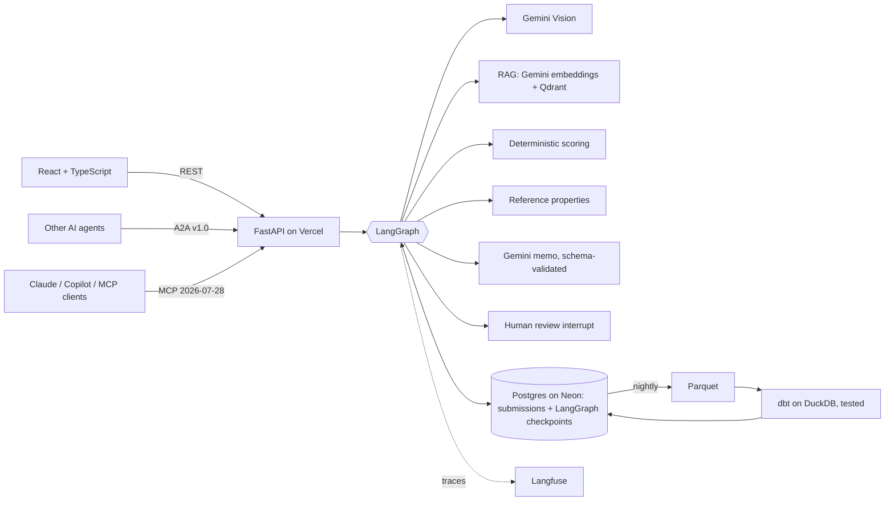

# imaarat.ai

**Imaarat** (Hindi/Urdu for "building") is AI-assisted underwriting for Indian commercial property. An underwriter enters a property and sees a live risk preview while typing. The system returns a decision backed by evidence: Gemini Vision observations from the property photo, guideline sections retrieved by RAG and cited in the memo, similar reference properties, and a validated AI memo. Referrals pause for an underwriter to approve or override. Every assessment feeds a nightly, tested analytics pipeline.

What it adds for India specifically:

- **Location hazard check.** Every PIN code (19,312 of them) is mapped to its district, its IS 1893 seismic zone, the share of its area flooded in 1998–2022 satellite records and the IMD cyclone grade of its district, all from open government data. A proposal that understates its seismic zone is scored at the official zone and flagged.
- **Paper proposals.** A printable two-page form in the chosen language, filled by hand. Only the property page is photographed; the AI reads it, and a person confirms the PIN code, year and amounts before anything is assessed.
- **26 languages.** English, the 22 Eighth Schedule languages, Bhojpuri, Chhattisgarhi and Tulu, with each script's font and right-to-left layout for Urdu, Sindhi and Kashmiri. Translations are machine-made and labelled as such.

Built by **Pranjal Jain, Adithya Shankaran and Sanjeev Sharma** as the capstone of Xebia's Quantum Shift AI Practitioner+ program (August 2026). Adithya extended it into this production-style version: evals, observability, MCP and A2A, human review, Postgres and the dbt pipeline.

**Live app:** [imaarat-ai.vercel.app](https://imaarat-ai.vercel.app) · **AI quality:** [evals page](https://imaarat-ai.vercel.app/#quality) · **dbt docs and lineage:** [GitHub Pages](https://adikshan11.github.io/uw-risk-assessment/) · **MCP:** `https://imaarat-ai.vercel.app/api/mcp/` · **A2A card:** [agent-card.json](https://imaarat-ai.vercel.app/api/.well-known/agent-card.json)

## The rule that shapes everything

**Python decides, Gemini explains.** A deterministic rule engine scores the property and owns the decision; the model can only explain it, and its output is checked mechanically before anyone sees it.

| Score | Decision |
|---|---|
| 0–30 | Accept |
| 31–60 | Refer (pauses for underwriter review) |
| 61–84 | Decline (mitigation possible) |
| 85–100 | Auto-Decline |

## Architecture

The layers, the rules CI enforces between them, and how to switch AI providers (for example to Amazon Bedrock) are in [ARCHITECTURE.md](ARCHITECTURE.md).



## AI engineering

| Capability | How |
|---|---|
| **Structured output** | Gemini's native JSON-schema mode with Pydantic models for the memo and vision output, plus a mechanical validator: the decision must match the engine, risk factors must be real flags, citations must be retrieved sections, and no invented amounts, rates or regulations. |
| **Reliability on the free tier** | One LLM layer (`app/llm.py`) with HTTP retries on 429/5xx and a model fallback (`gemini-3.8-flash` → `gemini-3.5-flash-lite`). AI failures degrade to "unavailable"; the deterministic decision always stands. |
| **RAG with citations** | Underwriting guidelines split into sections (G1–G12), embedded with `gemini-embedding-001`, stored in Qdrant Cloud and re-indexed automatically when the text changes. The memo cites the sections it used; citing anything not retrieved fails validation. |
| **Evals** | A 24-property golden set covering every scoring rule and band. It measures decision accuracy, retrieval hit rate, recall and MRR, the memo contract pass rate, citation precision, and faithfulness via a DeepEval LLM judge. Runs weekly in GitHub Actions; results appear on the app's **AI Quality** page. |
| **TOON vs JSON** | Evidence is sent to Gemini as TOON (official `toon-format`) or JSON. The eval measures both on the same prompts, for tokens, contract pass rate and faithfulness, instead of assuming. |
| **Observability** | Langfuse traces every graph node and Gemini call with tokens and latency; each assessment links to its public trace. |
| **Human in the loop** | LangGraph `interrupt()` pauses referrals; Postgres checkpoints let a reviewer resume them later, even after a serverless restart. Overrides require a written reason, enforced in the API and in dbt tests. |
| **MCP server** | `/api/mcp/`: tools `assess_property` (pass a `pincode` to verify hazards), `lookup_hazard`, `search_guidelines`, `get_assessment`, `list_assessments` and resource `uw://guidelines`, on the stateless 2026-07-28 spec. |
| **Reading paper forms** | Gemini returns every field of the photographed page with a confidence and the image area it came from (`/api/underwrite/read-form`). Blank boxes stay blank, and the values are checked outside the model: the PIN code must exist, years and amounts must be in range. The review screen shows each value beside its crop and blocks until a person confirms the critical ones. |
| **A2A agent** | Agent Card at `/api/.well-known/agent-card.json`, JSON-RPC at `/api/a2a`. Send property data to get an assessment, or a text question to get guideline sections. |

### Framework choices

- **LangGraph**, not CrewAI or AutoGen: underwriting needs deterministic control flow, checkpoints and human interrupts, which are LangGraph's strengths. Role-playing agent crews or conversational agents would add autonomy where it is not wanted.
- **Langfuse**, not LangSmith: open source, built on OpenTelemetry, and a larger free tier.
- **DeepEval** for LLM-judged metrics: actively maintained and pytest-style.
- **Not used:** n8n and Langflow are visual builders that hide the engineering. OpenClaw is a personal-assistant agent, not an application framework. LlamaIndex adds little for a 12-section corpus that Qdrant plus a few lines of code handle.

## AI budget

Every AI call is paid for from a daily budget before it is made, so a public demo cannot exhaust the Gemini quota or run up a bill.

- **Admission:** each assessment, paper-form reading, A2A request or MCP guideline search takes one slot from a global daily cap (`AI_DAILY_ADMISSIONS`, default 15) and from a per-visitor cap (`AI_CLIENT_DAILY_ADMISSIONS`, default 3), both or neither. Visitors are counted by a daily-rotating hash of their address, never the address itself.
- **Calls:** every Gemini attempt (generation, vision, embedding, token counting), including each retry, takes one call from `AI_DAILY_CALLS` (default 200). Text and image generations also count against Google's free-tier limits for gemini-3.8-flash: `AI_DAILY_GENERATIONS` (default 20) and `AI_MINUTE_GENERATIONS` (default 5). Embeddings and token counts have their own, larger Google limits and skip these two. Output is capped at `AI_STAGE_OUTPUT_TOKENS` (default 2048) per call.
- **Atomic:** a reservation is a single `UPDATE … SET used = used + n WHERE used + n <= cap`, so concurrent servers can never overspend; CI proves it with 20 parallel requests against a cap of 5 on real Postgres.
- **One model, honest failure:** a call uses only the configured model and retries only 429/500/503 errors, at most two attempts, and never retries a daily-quota 429. There is no fallback model.
- **Fail closed:** on Vercel the AI runs only when the budget lives in Postgres (`DATABASE_URL`), because per-instance SQLite counters are not a global limit. When the budget is spent, AI stages are skipped and the result says why and when the budget resets.
- **Resets** at midnight Pacific time, when Google's daily quotas reset. `/api/status` shows what is left; the `ai_usage` table records each call's stage, model, tokens, latency and outcome.

## Data engineering

```
Postgres (Neon) ──extract──▶ Parquet lake ──dbt build──▶ DuckDB marts ──publish──▶ Postgres snapshot ──▶ dashboard
```

- **Models:** `stg_submissions`, `stg_reference_properties` → `fct_assessments` and marts for CAT exposure, city accumulation, risk drivers, the review funnel, reference benchmarks and `mart_hazard_verification` (each proposal's declared hazards against the official ones for its PIN code).
- **Hazard pipeline:** `pipeline/hazard/build_hazard.py` downloads the open sources, overlays pincode boundaries with district, seismic-zone and flood-inundation polygons (Shapely), parses IMD's cyclone tables from the PDF, and maps old district names to current ones through a hand-checked crosswalk. It fails if IMD's published counts (100 districts: 12 P1, 25 P2, 48 P3, 15 P4) don't match. Output: a dbt seed and the JSON the API serves.
- **Data tests (25):** keys, accepted decision values, scores within 0–100, unique PIN codes, valid zones and grades, flood shares between 0 and 100. Each stored decision must match its score band, which is a contract with the application. Every override must carry a reason.
- **Orchestration:** GitHub Actions runs nightly; CI runs the backend tests, the frontend build and `dbt build` on every push. dbt docs and lineage are published to GitHub Pages.

## Run locally

```bash
pip install -r requirements.txt pytest httpx uvicorn
cd backend && cp .env.example .env     # GEMINI_API_KEY; optional QDRANT_*, LANGFUSE_*, DATABASE_URL
uvicorn app.api.main:app --port 8000 --reload
pytest -q                              # 91 tests
python -m evals.run_evals              # eval report (needs GEMINI_API_KEY)

cd ../frontend && npm ci && npm run dev            # http://localhost:3000
cd ../pipeline && pip install -r requirements.txt && python extract.py && (cd dbt && dbt build --profiles-dir .) && python publish.py
```

Without `DATABASE_URL` everything runs on SQLite; without `QDRANT_*` RAG uses a local JSON vector index; without `LANGFUSE_*` tracing is off.

## Deploy

One Vercel project: `frontend/` builds to static files, and `api/index.py` serves the FastAPI app as a Python function under `/api`. Set the same variables in Vercel and as GitHub Actions secrets (for the nightly pipeline and evals):

| Variable | Used for |
|---|---|
| `GEMINI_API_KEY` | Vision, embeddings, memo, eval judge |
| `QDRANT_URL`, `QDRANT_API_KEY` | RAG vector store |
| `LANGFUSE_PUBLIC_KEY`, `LANGFUSE_SECRET_KEY`, `LANGFUSE_HOST` | Tracing |
| `DATABASE_URL` | Postgres for submissions, checkpoints and analytics |
| `VERCEL_TOKEN` (GitHub only) | Preview and production deploys from CI |
| `VERCEL_AUTOMATION_BYPASS_SECRET` (GitHub only) | Smoke-testing protected previews |

## Run it yourself

Everything runs in Docker with one command: Postgres, the API and the website.

```bash
docker compose up --build
# open http://localhost:8080
```

AI features need `GEMINI_API_KEY` in your shell or in a `.env` file next to `compose.yaml`; without it the rules still decide every assessment. Images are defined in `deploy/docker/`, and CI builds and smoke-tests this exact stack on every pull request.

## CI/CD and conventions

`.github/workflows/ci.yml` runs in two stages, modelled on the framework repositories' Check and Deploy stages.

1. **Check**, on every pull request and every push to `main`:
   - release rules (pull requests only): branch name, one version across `backend/app/__init__.py` and `frontend/package*.json`, a version above `main`'s, and a CHANGELOG entry for it;
   - backend: ruff lint (including the Bandit security rules) and format check (settings in `ruff.toml`), then pytest against Postgres, with each test stopped after 120 seconds;
   - frontend: locale check, oxlint, type check and build, unit tests, then Playwright browser tests;
   - pipeline: extract and `dbt build`;
   - secrets: gitleaks over the full git history (allowed patterns in `.gitleaks.toml`);
   - container: build the images, start the compose stack and smoke-test it.
2. **Deploy**:
   - on a pull request, a Vercel preview is deployed and smoke-tested through Vercel's automation bypass;
   - on `main`, after every check passes, production is deployed and smoke-tested.

The smoke test (`.github/scripts/smoke_check.sh`) is shared by all three: the live `/api/status` must report this checkout's version, every public page must return 200, and the security headers must be present.

Conventions:

- Branches: `feature/`, `fix/`, `ci/`, `docs/` or `chore/` plus a snake_case name, for example `feature/react_landing`.
- One version bump and one CHANGELOG line per branch, in plain English. The CHANGELOG also feeds the public changelog page.
- Commit messages of two or three words; pull request bodies follow the template.
- Files and functions get short plain names (`hazard_lookup.py`, `portfolio_summary`).

## Hazard data sources

| Layer | Source | Licence |
|---|---|---|
| PIN code boundaries | India Post via data.gov.in (May 2025) | Government Open Data License - India |
| Districts | District boundaries with LGD codes | Government Open Data License - India |
| Seismic zones | IS 1893 (Part 1):2016 zone map, data.gov.in | Government Open Data License - India |
| Seismic zones of towns | IS 1893 (Part 1):2016 Annex E, 108 towns over 3 lakh people, applied within 10 km of each town's head post office | Zone values are facts from the standard; the standard is BIS copyright |
| Flood history | NRSC / NDEM flood inundation 1998–2022 | CC0 as published by the aggregator; NRSC terms not verified |
| City flood points | Greater Chennai Corporation inundation and 2015 flood points; BBMP flood-vulnerable, flood-prone and low-lying locations (OpenCity, November 2025) | Public domain, as published on OpenCity |
| Cyclone grades | IMD RSMC New Delhi, *Cyclone hazard prone districts of India*, June 2023 | No licence stated; cited with attribution |

The 2025 seismic code revision (which added Zone VI) was withdrawn in March 2026, so the 2016 zones apply.

## Limitations

- Scoring weights are prototype calibrations, not filed insurance rating rules; the guidelines are prototype guidance.
- The 300 reference properties are synthetic. The five demo properties use public names and images with assumed underwriting facts.
- Free tiers limit throughput (Gemini Flash is roughly 10 requests per minute), and evals throttle themselves accordingly.
- Hazard results are indicative. Near the 104 towns of the IS 1893 town list the code's own zone is used; elsewhere the zone map is coarse. Satellite flood maps miss urban waterlogging; city-recorded flood points cover only Chennai and Bengaluru so far. IMD grades whole districts.
- Handwriting accuracy has not been measured, so every value read from a paper form needs a person to check it. The free Gemini API may use uploads to improve Google's products, which is why only the property page, without personal details, is uploaded.
- The translations are machine-made and have not been reviewed by native speakers; Santali, Kashmiri, Manipuri, Bodo and Tulu are marked as drafts. Hindi follows the wording on IRDAI's Hindi policyholder pages where a term is given there (for example बीमित राशि, बीमांकन, संकट).

Changes are listed in [CHANGELOG.md](CHANGELOG.md).
