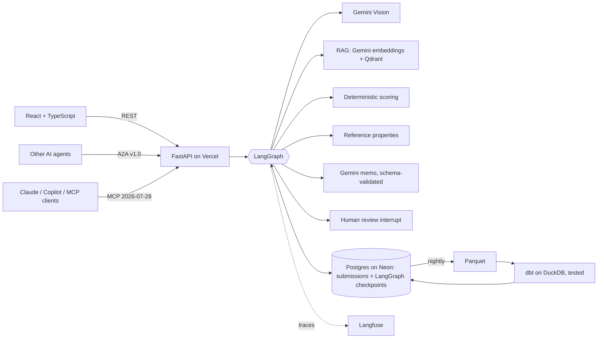

# Imaarat

**Imaarat** (Hindi/Urdu for "building") is AI-assisted underwriting for Indian commercial property. An underwriter enters a property and sees a live risk preview while typing. The system returns a decision backed by evidence: Gemini Vision observations from the property photo, guideline sections retrieved by RAG and cited in the memo, similar reference properties, and a validated AI memo. Referrals pause for an underwriter to approve or override. Every assessment feeds a nightly, tested analytics pipeline.

Built by **Pranjal Jain, Adithya Shankaran and Sanjeev Sharma** as the capstone of Xebia's Quantum Shift AI Practitioner+ program (August 2026). Adithya extended it into this production-style version: evals, observability, MCP and A2A, human review, Postgres and the dbt pipeline.

**Live app:** [uw-risk-assessment.vercel.app](https://uw-risk-assessment.vercel.app) · **AI quality:** [evals page](https://uw-risk-assessment.vercel.app/#quality) · **dbt docs and lineage:** [GitHub Pages](https://adikshan11.github.io/uw-risk-assessment/) · **MCP:** `https://uw-risk-assessment.vercel.app/api/mcp/` · **A2A card:** [agent-card.json](https://uw-risk-assessment.vercel.app/api/.well-known/agent-card.json)

## The rule that shapes everything

**Python decides, Gemini explains.** A deterministic rule engine scores the property and owns the decision; the model can only explain it, and its output is checked mechanically before anyone sees it.

| Score | Decision |
|---|---|
| 0–30 | Accept |
| 31–60 | Refer (pauses for underwriter review) |
| 61–84 | Decline (mitigation possible) |
| 85–100 | Auto-Decline |

## Architecture



## AI engineering

| Capability | How |
|---|---|
| **Structured output** | Gemini's native JSON-schema mode with Pydantic models for the memo and vision output, plus a mechanical validator: the decision must match the engine, risk factors must be real flags, citations must be retrieved sections, and no invented amounts, rates or regulations. |
| **Reliability on the free tier** | One LLM layer (`app/llm.py`) with HTTP retries on 429/5xx and a model fallback (`gemini-3.8-flash` → `gemini-3.5-flash-lite`). AI failures degrade to "unavailable"; the deterministic decision always stands. |
| **RAG with citations** | Underwriting guidelines split into sections (G1–G12), embedded with `gemini-embedding-001`, stored in Qdrant Cloud and re-indexed automatically when the text changes. The memo cites the sections it used; citing anything not retrieved fails validation. |
| **Evals** | A 24-property golden set covering every scoring rule and band. It measures decision accuracy, retrieval hit rate, recall and MRR, the memo contract pass rate, citation precision, and faithfulness via a DeepEval LLM judge. Runs weekly in GitHub Actions; results appear on the app's **AI Quality** page. |
| **TOON vs JSON** | Evidence is sent to Gemini as TOON (official `toon-format`) or JSON. The eval measures both on the same prompts, for tokens, contract pass rate and faithfulness, instead of assuming. |
| **Observability** | Langfuse traces every graph node and Gemini call with tokens and latency; each assessment links to its public trace. |
| **Human in the loop** | LangGraph `interrupt()` pauses referrals; Postgres checkpoints let a reviewer resume them later, even after a serverless restart. Overrides require a written reason, enforced in the API and in dbt tests. |
| **MCP server** | `/api/mcp/`: tools `assess_property`, `search_guidelines`, `get_assessment`, `list_assessments` and resource `uw://guidelines`, on the stateless 2026-07-28 spec. |
| **A2A agent** | Agent Card at `/api/.well-known/agent-card.json`, JSON-RPC at `/api/a2a`. Send property data to get an assessment, or a text question to get guideline sections. |

### Framework choices

- **LangGraph**, not CrewAI or AutoGen: underwriting needs deterministic control flow, checkpoints and human interrupts, which are LangGraph's strengths. Role-playing agent crews or conversational agents would add autonomy where it is not wanted.
- **Langfuse**, not LangSmith: open source, built on OpenTelemetry, and a larger free tier.
- **DeepEval** for LLM-judged metrics: actively maintained and pytest-style.
- **Not used:** n8n and Langflow are visual builders that hide the engineering. OpenClaw is a personal-assistant agent, not an application framework. LlamaIndex adds little for a 12-section corpus that Qdrant plus a few lines of code handle.

## Data engineering

```
Postgres (Neon) ──extract──▶ Parquet lake ──dbt build──▶ DuckDB marts ──publish──▶ Postgres snapshot ──▶ dashboard
```

- **Models:** `stg_submissions`, `stg_reference_properties` → `fct_assessments` and marts for CAT exposure, city accumulation, risk drivers, the review funnel and reference benchmarks.
- **Data tests (16):** keys, accepted decision values, scores within 0–100. Each stored decision must match its score band, which is a contract with the application. Every override must carry a reason.
- **Orchestration:** GitHub Actions runs nightly; CI runs the backend tests, the frontend build and `dbt build` on every push. dbt docs and lineage are published to GitHub Pages.

## Run locally

```bash
pip install -r requirements.txt pytest httpx uvicorn
cd backend && cp .env.example .env     # GEMINI_API_KEY; optional QDRANT_*, LANGFUSE_*, DATABASE_URL
uvicorn app.api.main:app --port 8000 --reload
pytest -q                              # 62 tests
python -m evals.run_evals              # eval report (needs GEMINI_API_KEY)

cd ../frontend && npm ci && npm run dev            # http://localhost:3000
cd ../pipeline && pip install -r requirements.txt && python extract.py && (cd dbt && dbt build --profiles-dir .) && python publish.py
```

Without `DATABASE_URL` everything runs on SQLite; without `QDRANT_*` RAG uses a local JSON vector index; without `LANGFUSE_*` tracing is off.

## Deploy

One Vercel project: `frontend/` builds to static files, and `api/index.py` serves the FastAPI app as a Python function under `/api`. Set the same variables in Vercel and as GitHub Actions secrets (for the nightly pipeline and evals):

| Variable | Used for |
|---|---|
| `GEMINI_API_KEY` | Vision, embeddings, memo, eval judge |
| `QDRANT_URL`, `QDRANT_API_KEY` | RAG vector store |
| `LANGFUSE_PUBLIC_KEY`, `LANGFUSE_SECRET_KEY`, `LANGFUSE_HOST` | Tracing |
| `DATABASE_URL` | Postgres for submissions, checkpoints and analytics |

## Limitations

- Scoring weights are prototype calibrations, not filed insurance rating rules; the guidelines are prototype guidance.
- The 300 reference properties are synthetic. The five demo properties use public names and images with assumed underwriting facts.
- Free tiers limit throughput (Gemini Flash is roughly 10 requests per minute), and evals throttle themselves accordingly.
