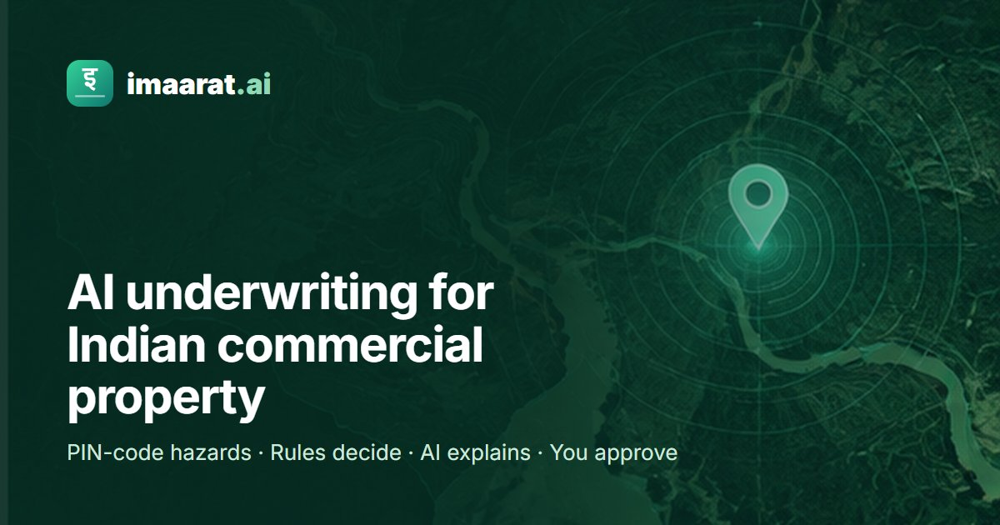
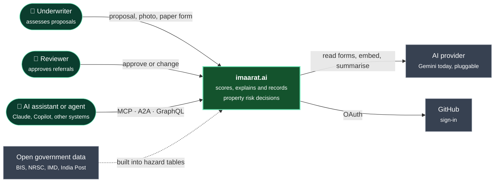
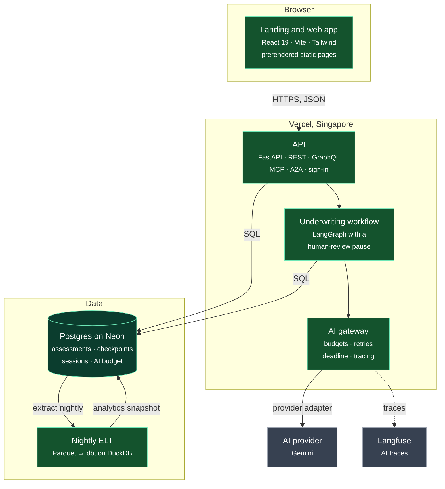
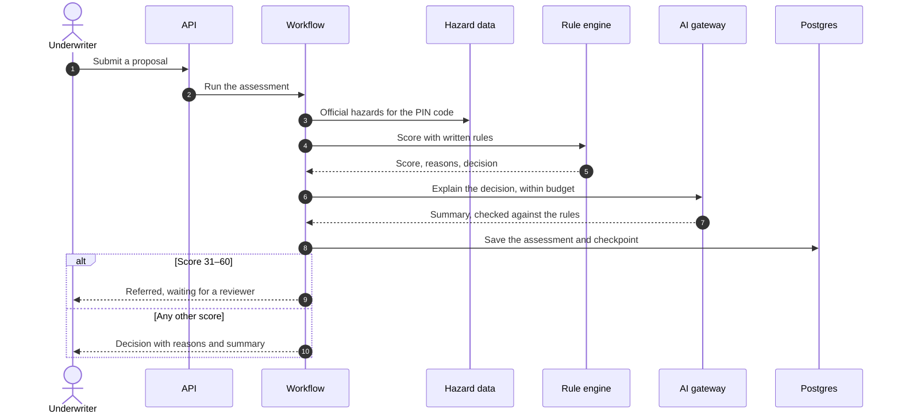

<p align="center">
  
</p>

<p align="center">
  <a href="https://imaarat-ai.vercel.app"><b>Live demo</b></a> ·
  <a href="https://imaarat-ai.vercel.app/app/">Open the app</a> ·
  <a href="ARCHITECTURE.md">Architecture</a> ·
  <a href="https://imaarat-ai.vercel.app/changelog/">Changelog</a> ·
  <a href="https://adikshan11.github.io/imaarat-ai/">Data lineage</a> ·
  <a href="https://github.com/adikshan11/imaarat-ai/issues">Report an issue</a>
</p>

<p align="center">
  <a href="https://github.com/adikshan11/imaarat-ai/actions/workflows/ci-cd.yml"></a>
  <a href="LICENSE"></a>
  
  
</p>

**imaarat.ai** (*imaarat* is Hindi and Urdu for "building") turns a commercial property proposal into a decision an underwriter can defend. It checks the proposal against official hazard data for its PIN code, scores it with written rules, explains the result in plain words with AI, and waits for a person to approve anything referred.

> **Rules decide · AI explains · You approve.** The model never makes the decision. A deterministic rule engine does, and every AI output is checked against it before anyone sees it.

## What it does

| Module | What you get |
|---|---|
| **Paper reader** | Photograph a hand-filled proposal in any of 26 Indian languages. AI reads every box with its confidence; a person confirms the key values. |
| **Hazard verification** | All 19,312 PIN codes mapped to their IS 1893 seismic zone, satellite flood history (1998–2022), city flooding spots and IMD cyclone grade. A proposal that understates its hazard is scored at the official value and flagged. |
| **Rule engine** | A 0–100 score with every point explained, and a decision: Accept, Refer, Decline (mitigation possible) or Auto-Decline. |
| **AI risk summary** | A plain-language explanation that may only use the facts above and cite the guideline sections it was given. |
| **Sign-off** | Referrals wait for a signed-in reviewer. A reviewer holds a referral while working on it, the first decision saved is final, overrides need a reason, and every decision exports as a PDF. |
| **Open APIs** | The same assessment for AI assistants (MCP), other agents (A2A) and your own systems (GraphQL and REST), under the same rules and limits. |

## Quick start

**Try it:** open the [live demo](https://imaarat-ai.vercel.app) with the sample proposals. No sign-up needed.

**Run it yourself** with Postgres, the API and the website in one command:

```bash
git clone https://github.com/adikshan11/imaarat-ai.git && cd imaarat-ai
docker compose up --build        # then open http://localhost:8080
```

Without an AI key the rules still decide every assessment. To switch the AI on, put `GEMINI_API_KEY=...` in a `.env` file next to `compose.yaml`.

**Use it from an AI assistant** over MCP:

```bash
claude mcp add --transport http imaarat https://imaarat-ai.vercel.app/api/mcp/
```

Tools: `assess_property`, `lookup_hazard`, `search_guidelines`, `get_assessment`, `list_assessments`. Other agents can read the A2A card at [`/api/.well-known/agent-card.json`](https://imaarat-ai.vercel.app/api/.well-known/agent-card.json).

## How a decision is made

| Score | Decision |
|---|---|
| 0–30 | Accept |
| 31–60 | Refer: paused until a reviewer approves or changes it |
| 61–84 | Decline (mitigation possible) |
| 85–100 | Auto-Decline |

## Architecture

The diagrams follow the [C4 model](https://c4model.com): first the system in its surroundings, then the containers inside it. They are Mermaid text in this file, so they are versioned and reviewed with the code. Components, the layer rules CI enforces and how to swap AI providers are in [ARCHITECTURE.md](ARCHITECTURE.md).

### System context



### Containers



### One assessment, end to end



## Tech stack

| Area | Choice | Why |
|---|---|---|
| Web | React 19, TypeScript, Vite, Tailwind CSS | Fast static pages; the landing page ships almost no JavaScript |
| API | FastAPI, Strawberry GraphQL, MCP and A2A SDKs | One backend for people, agents and other systems |
| Workflow | LangGraph with Postgres checkpoints | Fixed steps and a resumable human review |
| AI | Gemini through a provider adapter | Switch to Bedrock or another provider with configuration; see [ARCHITECTURE.md](ARCHITECTURE.md) |
| Data | Postgres on Neon, dbt on DuckDB | Transactions for the app, a tested nightly medallion pipeline (raw Parquet, cleaned staging, marts) for analytics |
| Quality | pytest, Playwright, DeepEval, Lighthouse, Locust | Every layer measured, with results on the status page |
| Delivery | GitHub Actions, Docker Compose, Vercel | Checked, tested and smoke-tested before every deploy |

## Repository layout

```
backend/
  app/            API, workflow, components, AI gateway, provider adapters
  evals/          golden set and quality metrics
  load/           load test
  tests/          unit, integration and architecture tests
frontend/
  src/landing/    landing, privacy, terms and changelog pages
  src/            the web app
pipeline/         nightly extract, dbt models and the hazard-data builder
deploy/docker/    images for the self-hosted stack
.github/          CI/CD, benchmark and nightly pipeline workflows
```

## Development

```bash
pip install -r requirements.txt pytest httpx uvicorn
cd backend && uvicorn app.api.main:app --port 8000 --reload   # API on :8000
pytest -q                                                    # backend tests

cd ../frontend && npm ci && npm run dev                       # app on :3000
npm run lint && npm test
```

Without `DATABASE_URL` the API uses SQLite; without `QDRANT_*` guideline search uses a local vector index; without `LANGFUSE_*` tracing is off.

### CI/CD

Three workflows, in the same shape as our other repositories:

- **CI/CD** on every pull request and every push to `preprod` or `main`: **Check** (release rules, secret scan, Ruff, Oxlint, translations), four parallel **Test** jobs (backend on Postgres, frontend with browser tests, pipeline, the Docker stack), then **Deploy**: a smoke-tested preview for a pull request, [imaarat-ai-preprod.vercel.app](https://imaarat-ai-preprod.vercel.app) for `preprod` followed by a read-only **Stress test**, and production for `main`.
- **Benchmarks**: evals and Lighthouse every week, and Lighthouse, the load test or the vision benchmark on demand. Results appear on the app's status page.
- **Nightly ELT**: the analytics pipeline and the published data lineage.

Branching: work goes into `preprod` first, and only `preprod` is released to `main`, so production changes only after preprod has been deployed and tested.

- Open each `feature/`, `fix/`, `ci/`, `docs/` or `chore/` branch (snake_case name) against `preprod`.
- Release by opening one pull request from `preprod` into `main`.
- After a release, reset `preprod` to `main` (`git push --force-with-lease origin origin/main:preprod`; only the repository admin may) so the two never drift.

Conventions: each `feature/` or `fix/` branch bumps the version once and adds one plain-English CHANGELOG line about what users will notice; `ci/`, `docs/` and `chore/` branches bump nothing and stay out of the changelog; commit messages of two or three words.

### Configuration

| Variable | Used for |
|---|---|
| `GEMINI_API_KEY` (or `AI_PROVIDER`, `AI_API_KEY`, `AI_MODEL`) | Reading forms, photo review, guideline search, summaries |
| `DATABASE_URL` | Postgres for assessments, checkpoints, sessions and budgets |
| `GITHUB_CLIENT_ID`, `GITHUB_CLIENT_SECRET`, `OPERATOR_GITHUB_IDS` | GitHub sign-in, needed for reviewing |
| `GOOGLE_CLIENT_ID`, `GOOGLE_CLIENT_SECRET` | Optional Google sign-in; the button appears only when both are set |
| `AI_SIGN_IN_REQUIRED` | Set to `true` to limit live AI to signed-in visitors; off by default, so the demo uses AI too |
| `QDRANT_URL`, `QDRANT_API_KEY` | Optional hosted vector store |
| `LANGFUSE_PUBLIC_KEY`, `LANGFUSE_SECRET_KEY`, `LANGFUSE_HOST` | Optional AI tracing |
| `VERCEL_TOKEN`, `VERCEL_AUTOMATION_BYPASS_SECRET` (GitHub only) | Deploys and preview smoke tests |

## Hazard data sources

| Layer | Source | Licence |
|---|---|---|
| PIN code boundaries | India Post via data.gov.in (May 2025) | Government Open Data License - India |
| Districts | District boundaries with LGD codes | Government Open Data License - India |
| Seismic zones | IS 1893 (Part 1):2016 zone map, data.gov.in | Government Open Data License - India |
| Seismic zones of towns | IS 1893 (Part 1):2016 Annex E, towns over 3 lakh people, applied within 10 km of each town's head post office | Zone values are facts from the standard; the standard is BIS copyright |
| Flood history | NRSC / NDEM flood inundation 1998–2022 | CC0 as published by the aggregator; NRSC terms not verified |
| City flood points | Greater Chennai Corporation; BBMP flood-prone and low-lying locations (OpenCity, November 2025) | Public domain, as published on OpenCity |
| Cyclone grades | IMD RSMC New Delhi, *Cyclone hazard prone districts of India*, June 2023 | No licence stated; cited with attribution |

The 2025 seismic code revision (which added Zone VI) was withdrawn in March 2026, so the 2016 zones apply.

## Limitations

- Scoring weights and guidelines are prototype calibrations, not filed rating rules. Decisions are indicative, not an insurer's offer.
- The 300 reference properties are synthetic; the demo properties use public names with assumed facts.
- The public demo runs on Gemini's free tier: 20 AI summaries a day, shared by everyone. Google may use free-tier inputs to improve its products, so the demo is for sample data only; real data needs a paid key.
- Handwriting accuracy has not been measured on real forms, so every value read from paper is confirmed by a person.
- Translations are machine-made; Santali, Kashmiri, Manipuri, Bodo and Tulu are drafts awaiting native review.
- Hazard results are indicative: satellite flood maps miss urban waterlogging, and city flood points cover only Chennai and Bengaluru so far.

## Credits and licence

Started by **Pranjal Jain, Adithya Shankaran and Sanjeev Sharma** as the capstone of Xebia's Quantum Shift AI Practitioner+ programme (August 2026), and extended by Adithya into this production version.

Released under the [MIT License](LICENSE). Changes are listed in [CHANGELOG.md](CHANGELOG.md).
